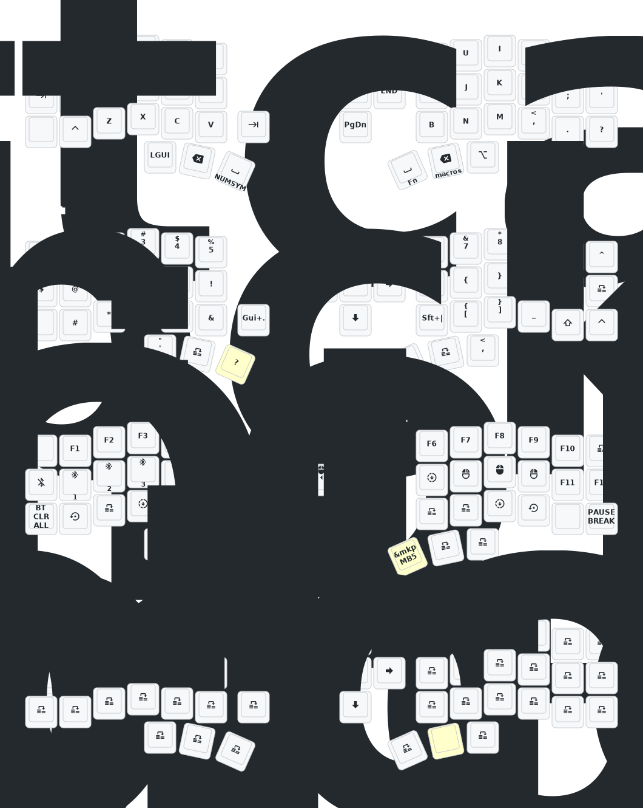

# (Eyelash Peripherals) Corne ZMK Repository

**This keyboard is not the same as [foostan's Corne](https://github.com/foostan/crkbd). It will not work with standard `corne` firmware.**

## Instructions
1. [Fork this repository](https://docs.github.com/en/get-started/quickstart/fork-a-repo#forking-a-repository).
2. [Click the **Actions** tab and make sure the workflow is enabled](https://docs.github.com/en/actions/managing-workflow-runs-and-deployments/managing-workflow-runs/disabling-and-enabling-a-workflow#enabling-a-workflow).
3. Make sure the `eyelash_corne` project in [`config/west.yml`](config/west.yml) still works. The `boards/arm/eyelash_corne` folder will be downloaded from this URL. You need to change the URL to your forked repo URL.

## How to edit via GUI
Use https://nickcoutsos.github.io/keymap-editor/ and connect your github account to access your forked repo.

## How to flash
Download firmware archive in github actions workflow "Build ZMK firmware" and unzip.

1. Restart one half of the keyboard to bootloader mode (either using default keybind that came with the keyboard or hold down reset button while plugging into the PC and letting go after few seconds, it may take a few tries). You will know it is in BL mode when a USB storage device shows up on your PC.
2. Drag or copy nice_view-eyelash_corne_left-zmk.uf2 to left keyboard, or nice_view-eyelash_corne_right-zmk.uf2 for right keyboard to the USB storage device that showed up when the keyboard was connected in BL mode.

## Keymap Diagram

